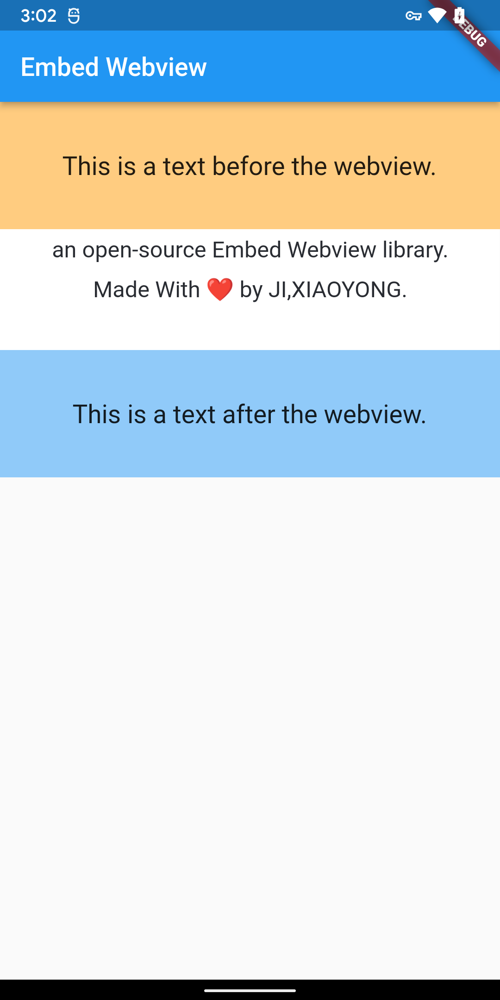

# [embed_webview](https://github.com/jixiaoyong/embed_webview)

[](https://pub.dev/packages/embed_webview)  

`embed_webview` is a widget that displays web view content inner flutter widget. It can change its size automatically to fit the children.

By now, it supports Android/iOS/Web.


## Getting started

Add `embed_webview` to your project:

```yaml
dependencies:
  flutter:
    sdk: flutter

  embed_webview: latest_version
```

## Usage

Simply use it as other flutter widgets:

```dart
const String SampleWebContent =
    """<p style="text-align: center;"><span style="color: rgb(41, 44, 50); font-size: 19px;">an&nbsp;open-source&nbsp;Embed&nbsp;Webview&nbsp;library.</span></p><p style="text-align: center;"><span style="color: rgb(41, 44, 50); font-size: 19px;">Made&nbsp;With&nbsp;❤️&nbsp;by&nbsp;JI,XIAOYONG.</span></p><p><br></p>""";

// somewhere need a widget:
return EmbedWebView(SampleWebContent);
```

Save and run the project, you will see the web content:


# More

For more Infomation please checkout: [example](./example).

# License

```
Copyright 2022-present jixiaoyong

Licensed under the Apache License, Version 2.0 (the "License");
you may not use this file except in compliance with the License.
You may obtain a copy of the License at

    http://www.apache.org/licenses/LICENSE-2.0

Unless required by applicable law or agreed to in writing, software
distributed under the License is distributed on an "AS IS" BASIS,
WITHOUT WARRANTIES OR CONDITIONS OF ANY KIND, either express or implied.
See the License for the specific language governing permissions and
limitations under the License.
```

